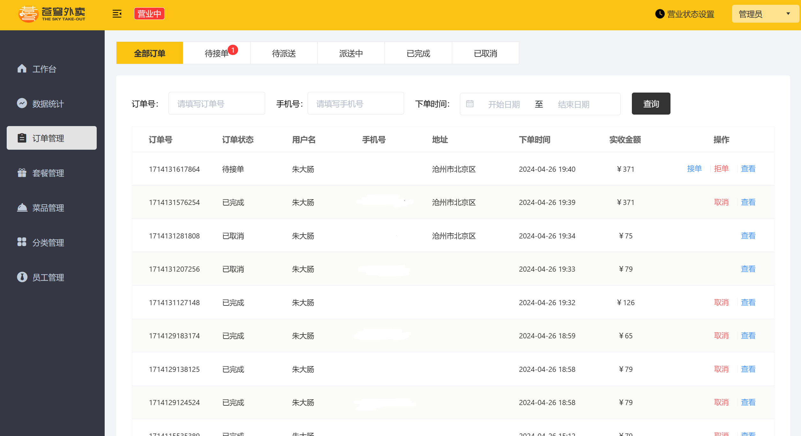

# 苍穹外卖 Sky-Take-Out

## 技术栈

SpringBoot+Mysql+Vue3+WebSocket+Redis+ElementUI

## 环境搭建

- **前端**
  - Web文件夹下运行nginx.exe文件
- 小程序
  - 微信开发者工具打开 WeiXinApp 文件夹
- 后端
  - 更改sky-server里面的application-dev.yml文件内容
- 数据库
  - 运行sky_take_out.sql

## 项目截图

- 

- 
- 
- 
- 